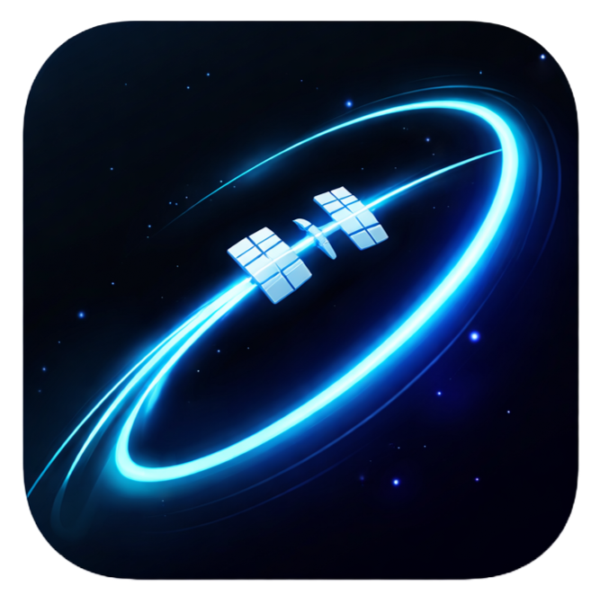

<div align="center">



# 🛰️ ORBITWATCH

**Track the International Space Station in real-time on a 3D globe.**


<br>

*Minimal · Big Text · Dark · Data-Forward*

</div>

---

## ✦ What It Does

A zero-build, single-page ISS tracker with a 3D globe, real-time data, and 9 interactive tools — all hidden behind a clean toolbar.

```
┌─────────────────────────────────────────────────────────────┐
│ ORBITWATCH  [☀][☁] | [⚡][📊][🛰][📍][☄️] | [📹][🔊]  ● LIVE │
├──────────────────┬──────────────────────────────────────────┤
│                  │                                          │
│  ISS             │              3D GLOBE                    │
│  28.4532° N      │        Day/Night Terminator              │
│  80.6481° W      │        Real-time Clouds                  │
│                  │        City Lights                       │
│  408 KM  27.6K   │                                          │
│                  │                                          │
│  ● 6 ASTRONAUTS  │                                          │
│                  │                                          │
├──────────────────┴──────────────────────────────────────────┤
│ DATA FROM NASA                                    EVERY 5S  │
└─────────────────────────────────────────────────────────────┘
```

---

## ✦ Features

| | Feature | Description |
|---|---|---|
| ☀ | **Day/Night Cycle** | Custom GLSL shader with real-time sun position |
| ☁ | **Cloud Layer** | Rotating transparent cloud sphere |
| ⚡ | **Speed Comparison** | Animated bars — ISS vs car, plane, bullet, sound |
| � | **Stats Dashboard** | Days in orbit, distance traveled, live sunrise counter |
| 🛰 | **Telemetry** | Simulated ISS systems data with status bars |
| � | **Pass Prediction** | Your next ISS flyover via satellite.js + CelesTrak |
| ☄️ | **Meteor Showers** | Active & upcoming showers with peak alerts |
| � | **Live Camera** | YouTube ISS stream embed with source switching |
| 🔊 | **Ambient Sound** | Web Audio API generated ISS interior atmosphere |

> Everything lives in slide-in drawers. The main view stays clean.

---

## ✦ Quick Start

```bash
npx serve . -p 3456
```

Open `http://localhost:3456` — that's it. No build step, no dependencies to install.

---

## ✦ Tech

| Layer | Tech |
|-------|------|
| Globe | [Globe.gl](https://globe.gl) + [Three.js](https://threejs.org) |
| Shaders | Custom GLSL (day/night blending) |
| Orbit | [satellite.js](https://github.com/shashwatak/satellite-js) + CelesTrak TLE |
| Audio | Web Audio API (procedural) |
| Data | NASA Open Notify · wheretheiss.at · Nominatim |
| Fonts | [Space Mono](https://fonts.google.com/specimen/Space+Mono) + [Inter](https://fonts.google.com/specimen/Inter) |

---

## ✦ Structure

```
orbit-watch/
├── index.html          ← Single page with 9 toolbar buttons + 6 drawer panels
├── css/
│   └── style.css       ← Design system: tokens, layout, all component styles
├── js/
│   ├── app.js          ← Globe init, GLSL shader, clouds, data fetch (ES module)
│   ├── panels.js       ← Drawer system, speed/stats/telemetry, camera, audio
│   └── predictions.js  ← Pass prediction, meteor shower calendar
└── README.md
```

---

## ✦ Design

| Token | Value |
|-------|-------|
| Background | `#0a0a0a` |
| Accent | `#00e5ff` |
| Display Font | Space Mono 700 |
| Body Font | Inter 300 |

<div align="center">

*Inspired by Linear, Framer, and mission control interfaces.*

---

**Abhishek Yadav**

</div>
